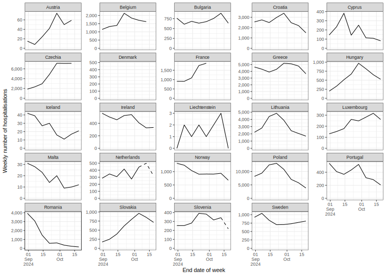
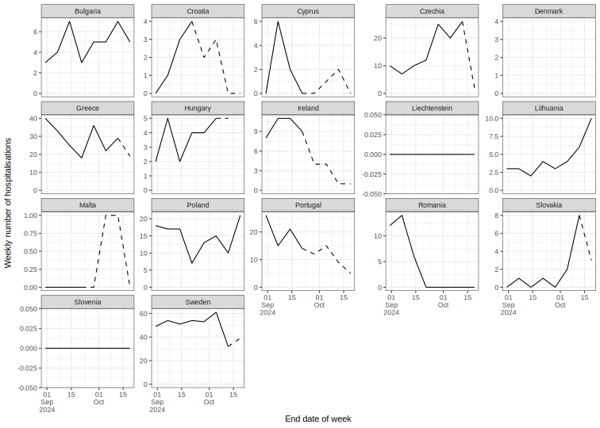

European data status
================

## Truth data

### Hospitalisations

- Czechia, Estonia, Greece, Ireland, Italy, Latvia, Malta, Netherlands,
  Slovakia

The Hub validates and evaluates hospitalisation forecasts against data
collated by [Our World in
Data](https://ourworldindata.org/covid-hospitalizations), provided in
the [OWID](OWID) directory. These data are provided as reported by
national health authorities and therefore are not consistent in
definition, and care needs to be taken in interpreting them.

One particular issue that affects several of the hospitalisation data
streams it the one of right truncation. This occurs when these are
reported with a delay, and therefore recent data need to be treated as
incomplete, posing additional challenges to forecasting such data
streams and validating forecasts.

For our visualisations and assesments of forecast performance we treat
hospitalisation as *final* 28 days after the reported date. Any further
revisions will be ignored for the purposes of the Hub.

We provide multiple views of the data in order to facilitate modelling
of COVID-19 hospitalisations with a 28 day cutoff. In the
[OWID/snapshot](OWID/snapshot) directory we provide daily snapshots of
the COVID-19 hospitalisation data as collated by Our World in Data,
before any further processing is applied. The data in there are given
either as rolling weekly sums of daily data, or weekly data. In the
[OWID/final](OWID/final) directory we provide data that are considered
“final”, i.e. they stop 28 days before the latest date. The files in
this directory are the ones used for scoring the forecasts for their
performance against observed data.

The single dataset in [OWID/truth_OWID-Incident
Hospitalizations.csv](OWID/truth_OWID-Incident%20Hospitalizations.csv)
contains the latest data, where the final versions of the data are
included for dates more than 28 days before the latest snapshot date,
and the most recent version for any subsequent data. This is the dataset
recommended for use in models that can take into account the truncation
of the data. Please note that the `date` field in this file corresponds
to the final day of the week reported, and any data reported at weekly
frequency has been shifted back one day to Saturday (instead of Sunday)
in that file to comply with the Hub definition of an epidemiological
week (Sunday-Saturday). Past versions of this data set are in the
[OWID/truth](OWID/truth) directory.

We further provide a set of [recommended
cutoffs](OWID/recommended-cutoffs.csv) for use with these data. These
are estimates of the truncation in the number of weeks that should be
cut off the data set if the aim is to have a data set that is not
further revised by more than 5%. The corresponding dataset in
[OWID/truncated_OWID-Incident
Hospitalizations.csv](OWID/truth_OWID-Incident%20Hospitalizations.csv)
has these recent weeks removed and is recommended for use in models that
cannot take into account the truncation of the data.

The latest hospitalisation data is plotted below, with the dashed line
indicating data expecting to be substanially revised.

### Cases and deaths

- Cases: Austria, Belgium, Bulgaria, Croatia, Cyprus, Czechia, Denmark,
  Estonia, Finland, France, Germany, Greece, Hungary, Iceland, Ireland,
  Italy, Latvia, Liechtenstein, Lithuania, Luxembourg, Malta,
  Netherlands, Norway, Poland, Portugal, Romania, Slovakia, Slovenia,
  Spain, Sweden

- Deaths: Austria, Belgium, Bulgaria, Croatia, Cyprus, Czechia, Denmark,
  Estonia, Finland, France, Germany, Greece, Hungary, Iceland, Ireland,
  Italy, Latvia, Liechtenstein, Lithuania, Luxembourg, Malta,
  Netherlands, Norway, Poland, Portugal, Romania, Slovakia, Slovenia,
  Spain, Sweden

- **Data warning!** Recent missing data for cases in: Austria, Cyprus,
  Denmark, France, Germany, and Spain

- **Data warning!** Recent missing data for deaths in: Austria, Belgium,
  Cyprus, Denmark, France, Germany, Hungary, Iceland, Luxembourg,
  Netherlands, Norway, and Spain

We further evaluate forecasts of cases and deaths against data provided
[ECDC](https://www.ecdc.europa.eu/), which we recommend using as the
basis for corresponding forecasts. These data are provided as reported
by national health authorities and therefore are not consistent in
definition, and care needs to be taken in interpreting them.

One particular issue that affects several of the case/death data streams
it the one of right truncation. This occurs when these are reported with
a delay, and therefore recent data need to be treated as incomplete,
posing additional challenges to forecasting such data streams and
validating forecasts.

For our visualisations and assesments of forecast performance we treat
cases and deaths as *final* 28 days after the reported date. Any further
revisions will be ignored for the purposes of the Hub.

We provide multiple views of the data in order to facilitate modelling
of COVID-19 cases and deaths with a 28 day cutoff. In the
[ECDC/snapshot](ECDC/snapshot) directory we provide weekly snapshots of
the COVID-19 case and death data as collated by ECDC, before any further
processing is applied. The data in there are given either as weekly sums
of cases/deaths. In the [ECDC/final](OWID/final) directory we provide
data that are considered “final”, i.e. they stop 28 days before the
latest date. The files in this directory are the ones used for scoring
the forecasts for their performance against observed data.

The single datasets in [ECDC/truth_ECDC-Incident
Cases](ECDC/truth_ECDC-Incident%20Cases) and [ECDC/truth_ECDC-Incident
Deaths](ECDC/truth_ECDC-Incident%20Deaths) contain the latest data,
where the final versions of the data are included for dates more than 28
days before the latest snapshot date, and the most recent version for
any subsequent data. These are the dataset recommended for use in models
that can take into account the truncation of the data. Please note that
the `date` field in this file corresponds to the final day of the week
reported, and the data has been shifted back one day to Saturday
(instead of Sunday) in that file to comply with the Hub definition of an
epidemiological week (Sunday-Saturday). Past versions of this data set
are in the [ECDC/truth](ECDC/truth) directory.

We further provide a set of [recommended
cutoffs](ECDC/recommended-cutoffs.csv) for use with these data. These
are estimates of the truncation in the number of weeks that should be
cut off the data set if the aim is to have a data set that is not
further revised by more than 5%. The corresponding datasets in
[ECDC/truncated_ECDC-Incident
Cases.csv](ECDC/truth_ECDC-Incident%20Cases.csv) and
[ECDC/truncated_ECDC-Incident
Deaths.csv](ECDC/truth_ECDC-Incident%20Deaths.csv) have these recent
weeks removed and is recommended for use in models that cannot take into
account the truncation of the data.

The latest case/death data is plotted below, with the dashed line
indicating data expecting to be substanially revised.

 

## Additional data sources

We do not use or evaluate against these data, but the following might be
useful for modelling targets:

| Data                | Description                                                                                                                              | Source | Link                                                                                                                            |
|---------------------|------------------------------------------------------------------------------------------------------------------------------------------|--------|---------------------------------------------------------------------------------------------------------------------------------|
| Vaccination         | Number of vaccine doses distributed by manufacturers, number of first, second and unspecified doses administered                         | ECDC   | [Data on COVID-19 vaccination in the EU/EEA](https://www.ecdc.europa.eu/en/publications-data/data-covid-19-vaccination-eu-eea)  |
| Variants of concern | Volume of COVID-19 sequencing, the number and percentage distribution of VOC for each country, week and variant submitted since 2020-W40 | ECDC   | [Data on SARS-CoV-2 variants in the EU/EEA](https://www.ecdc.europa.eu/en/publications-data/data-virus-variants-covid-19-eueea) |
| Testing             | Weekly testing rate and weekly test positivity                                                                                           | ECDC   | [Data on testing for COVID-19 by week and country](https://www.ecdc.europa.eu/en/publications-data/covid-19-testing)            |
