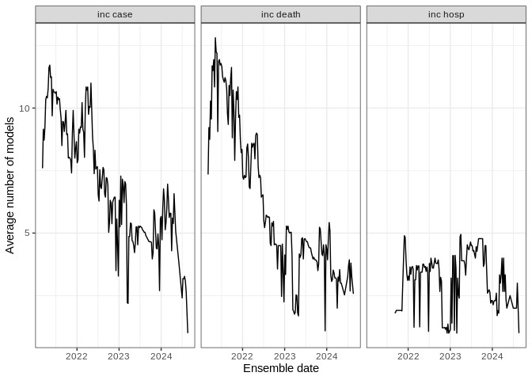
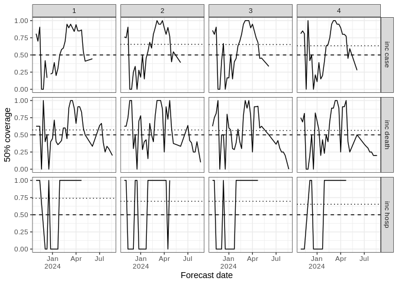

Evaluation
================
Sebastian Funk & Kath Sherratt
14 October, 2024

# Data files of forecast scores

The files `scores.csv` contains “raw” scores for each data/forecast
point based on the predictive quantiles and where the data ended up
relative to them. For each combination of date, target variable and
location we report the [Weighted Interval
Score](https://journals.plos.org/ploscompbiol/article?id=10.1371/journal.pcbi.1008618)
(`wis`) as well as its components of `sharpness`, `underprediction` and
`overprediction`, the absolute error of the median (`aem`),
[Bias](https://doi.org/10.1371/journal.pcbi.1006785) (`bias`), coverage
at the 50 and 95% levels (`cov_50`/`cov_95`), and the number of
quantiles supplied (`n_quantiles`).

The `weekly-summary` folder contains weekly evaluations that enter the
[weekly performance
reports](https://covid19forecasthub.eu/reports.html).

# Ensemble performance

## Number of models in ensemble

The number of models used in the ensemble (average across all available
locations).

<!-- -->

## Coverage

Ensemble coverage at 50% and 95% (dashed reference line), showing
coverage at each one to four week horizon over time (black line) and
average coverage across the four horizons (dotted reference line).

### 50% Coverage

    ## Warning: Removed 1 rows containing missing values (`geom_hline()`).

<!-- -->

### 95% Coverage

    ## Warning: Removed 1 rows containing missing values (`geom_hline()`).

<!-- -->

## Relative performance

Performance is relative to a baseline (a flat constant projection with
expanding uncertainty over time). Performance is shown over the
preceding 10 weeks.

### Relative WIS (10 weeks)

<!-- -->

### Relative AE (10 weeks)

<!-- -->
